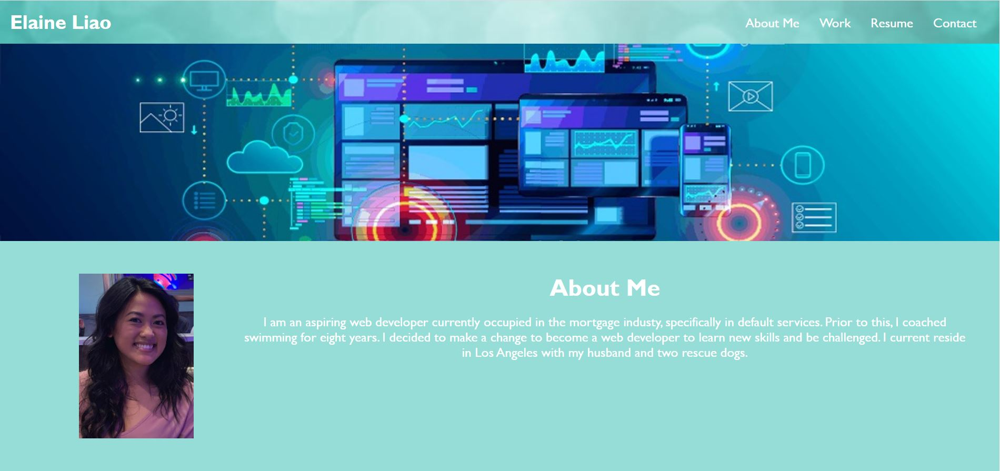

# week-2-challenge
Week 2 Challenge 

1. Includes the develope's name
2. Includes the links and photo of developer
3. Links navigate to corresponding sections of the page
4. Includes first application from week 1 challenge

Screenshot of website

[URL of GitHub Repository](https://github.com/ehliao/week-2-challenge)

[URL of deployed application](https://ehliao.github.io/week-2-challenge/)